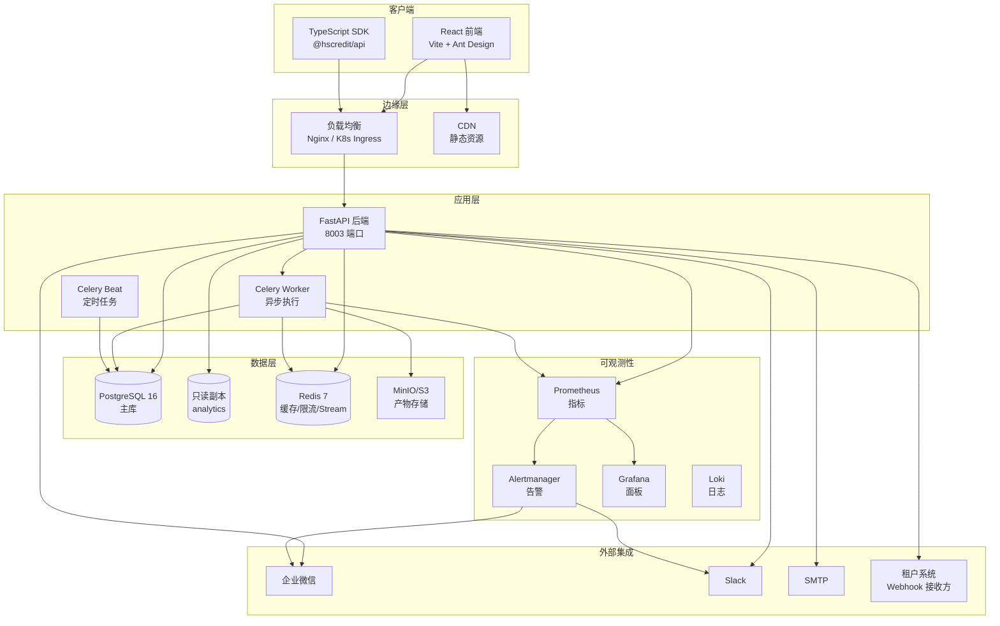
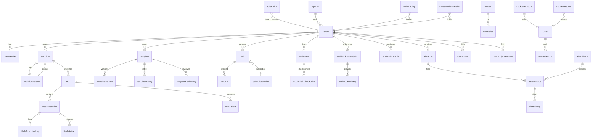
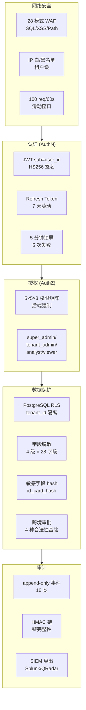
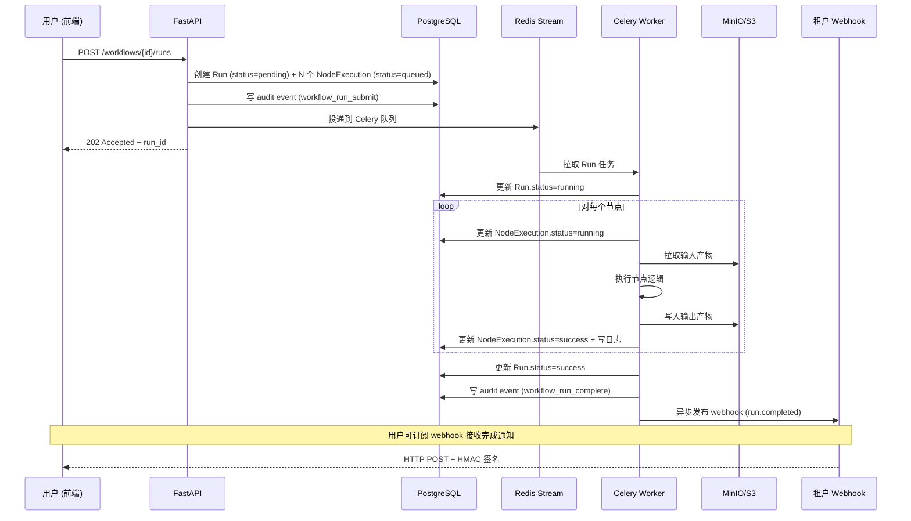
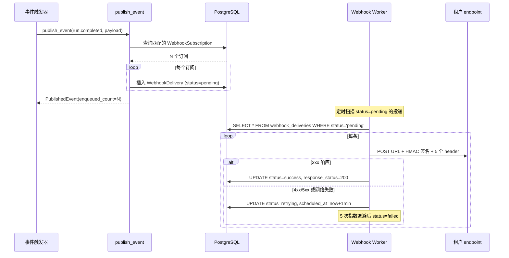
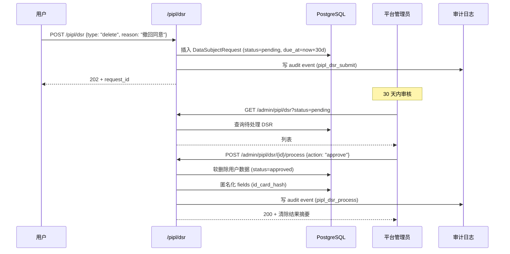
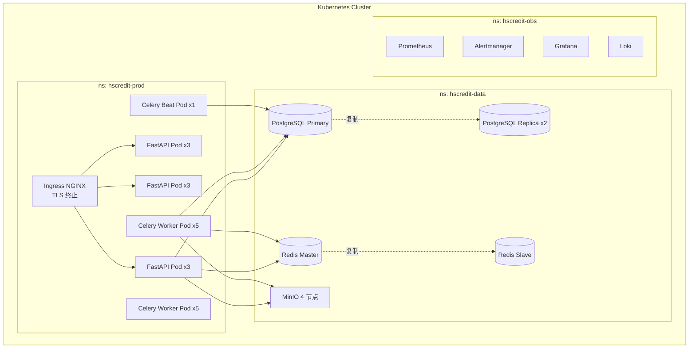

# HSCredit Studio 架构设计

> 平台架构概览, 系统组件图, 数据流, 技术栈, 安全边界
>
> 适用版本: v0.1.x · 最近更新: 2026-08-28

---

## 1. 系统定位

HSCredit Studio 是**多租户 SaaS 信用风险建模平台**, 在衡枢真信 (hscredit) 评分卡工具箱基础上提供:

- **可视化工作流编排** — React Flow 拖拽式节点编排
- **多租户隔离** — 租户级 RLS + JWT 鉴权
- **节点沙箱化执行** — Celery 异步任务队列
- **合规闭环** — 等保三级 + PIPL + GDPR
- **计费计量** — 订阅 + 用量 + 账单

**核心价值**: 把 hscredit 的 Python 评分卡建模能力包装成可订阅的 SaaS 服务, 让金融机构客户无需自建工程团队即可使用。

---

## 2. 顶层架构



---

## 3. 后端模块架构

后端按"业务域"划分, 每个域有独立的 service + schemas + API 路由:

```mermaid
graph LR
    subgraph Core["核心"]
        Auth[auth.py<br/>JWT 登录]
        RBAC[rbac.py<br/>5×5×3 权限矩阵]
        Audit[audit.py<br/>append-only 事件]
    end

    subgraph Workflow["工作流域"]
        Workflows[workflows.py]
        Runs[runs.py]
        Templates[templates.py]
        IndustryTpl[industry_templates.py]
        TplShare[template_sharing.py]
    end

    subgraph Exec["执行域"]
        Sandbox[sandbox.py<br/>K8s Job]
        Contracts[contracts.py<br/>节点契约]
        NodeDef[nodes.py]
    end

    subgraph Billing["计费域"]
        Billing[billing.py]
        Quota[quota.py]
        Contracts2[contracts.py<br/>业务合同]
        VAT[vat_invoice.py]
    end

    subgraph Compliance["合规域"]
        PIPL[pipl.py]
        DataClass[data_classification.py]
        Security[security_hardening.py]
    end

    subgraph Observability["可观测性"]
        Alerts[alert_rules.py]
        Notify[notification.py]
        Monitor[monitor.py]
        Webhook[webhooks.py]
    end

    subgraph Admin["管理域"]
        Admin[admin_console.py]
        RBAC2[rbac.py]
    end

    subgraph BI["报表域"]
        BIExport[bi_export.py]
        ModelExport[model_export.py]
    end

    Core --> Workflow
    Core --> Exec
    Core --> Billing
    Core --> Compliance
    Core --> Observability
    Compliance --> Admin
    Observability --> Admin
    Workflow --> BI
```

---

## 4. 数据模型 (PostgreSQL)

### 4.1 核心实体关系图



### 4.2 数据库迁移历史

| 版本 | 阶段 | 主要变更 |
|------|------|----------|
| 0001 | Phase 1 | 初始 schema (12 张表) |
| 0002 | Phase 2 | node_resource_usage |
| 0003 | Phase 4 | billing + invoices |
| 0004 | Phase 4 | contracts + vat_invoice |
| 0005 | Phase 5 | notifications (B23) |
| 0006 | Phase 5 | security (B25) |
| 0007 | Phase 5 | PIPL (B26) |
| 0008 | Phase 5 | alerts (B27) |
| 0009 | Phase 6 | RBAC (B28) |
| 0010 | Phase 6 | rbac 修补 (B29) |
| 0011 | Phase 6 | template_sharing (B31) |
| 0012 | Phase 7 | BI views (B33) |
| **0013** | **Phase 8** | **webhook_subscriptions + webhook_deliveries (B35)** |

### 4.3 BI 视图清单 (0012)

| 视图 | 来源 | 用途 |
|------|------|------|
| `v_bi_audit_recent` | audit_events | 近 90 天审计事件 (扁平化 JSONB) |
| `v_bi_run_summary` | runs | Run 汇总 (含 node_count / duration_ms) |
| `v_bi_usage_daily` | runs | 用量按日聚合 (run/duration/failed/success) |
| `v_bi_billing_summary` | bills | 账单汇总 |

---

## 5. 关键技术决策

### 5.1 选型理由

| 组件 | 选型 | 备选 | 理由 |
|------|------|------|------|
| 后端框架 | FastAPI | Flask / Django | 异步原生 + OpenAPI 自动生成 |
| ORM | SQLAlchemy 2.0 async | Tortoise / Piccolo | 成熟 + 异步 + 类型提示完善 |
| 数据库 | PostgreSQL 16 | MySQL | RLS + JSONB + CTE |
| 缓存 | Redis 7 | Memcached | Stream + Pub/Sub + Lua 原子 |
| 异步任务 | Celery | Dramatiq / RQ | 生态最广 + Beat 调度 |
| 对象存储 | MinIO / S3 | 本地文件 | 大产物 + 跨区复制 |
| 鉴权 | JWT (sub=user_id) | Session | 无状态 + 跨域 |
| 前端 | React + Vite | Next.js | 部署轻量 + SPA |
| 节点沙箱 | K8s Job | Docker / Firecracker | 隔离强 + 自动重启 |
| 通知 | Slack/WeCom/SMTP | 邮件全栈 | 客户集成习惯 |

### 5.2 安全模型



### 5.3 可观测性矩阵

| 组件 | 指标 (Prometheus) | 日志 (Loki) | 追踪 (OTel) | 告警 (Alertmanager) |
|------|-------------------|-------------|-------------|---------------------|
| FastAPI | request_total / duration_seconds | 结构化 JSON | HTTP span | 5xx 率 > 5% |
| Celery Worker | task_total / duration | 任务日志 | Task span | 队列长度 > 1000 |
| PostgreSQL | connections / qps / locks | pg_log | DB span | 慢查询 > 5s |
| Redis | memory / hit_rate | - | - | OOM 风险 |
| Sandbox (K8s) | pod_restarts / cpu / mem | kubectl logs | Job span | OOMKilled > 3/min |
| Webhook | delivery_success_rate | webhook_sent | - | 失败率 > 10% |
| Audit | events_per_min | audit_log | - | 链断裂 |

---

## 6. 关键数据流

### 6.1 工作流执行流程



### 6.2 Webhook 投递流程



### 6.3 合规审计流 (PIPL DSR)



---

## 7. 部署架构

### 7.1 生产部署 (Kubernetes)



### 7.2 本地开发

参见 [DEVELOPMENT.md](DEVELOPMENT.md):

- 后端: Python 3.11 + venv (`.venv/Scripts/python.exe`)
- 前端: Node.js 18+ + Vite
- 数据库: PostgreSQL 16 (Docker / 本地)
- 缓存: Redis 7
- 对象存储: MinIO (Docker)

启动命令:

```bash
make dev-up         # docker compose up
make backend-dev    # cd backend && ./.venv/Scripts/python.exe -m uvicorn hscredit_studio.main:app --reload --port 8003
make frontend-dev   # cd frontend && npm run dev
```

---

## 8. 性能预算

| 指标 | 当前 (v0.1) | 目标 (v0.2) | Phase 5 目标 |
|------|-------------|-------------|--------------|
| Run P50 端到端 (10 节点) | 60s | 90s (沙箱) | 60s (镜像优化) |
| API P95 响应 | 200ms | 200ms | 150ms |
| WebSocket 推送延迟 | <1s | <1s | <500ms |
| 多租户并发 | 10 | 50 | 200 |
| Webhook 投递 P95 | <2s | <2s | <1s |
| 审计事件写入吞吐 | 100/s | 1000/s | 5000/s |

性能优化方向:

- **缓存层**: Redis 缓存配额查询 (B19 用量)、节点契约 (B12)、权限矩阵 (B28)
- **批量 API**: Run 批量提交、NodeExecution 批量状态更新
- **数据库**: 连接池 (20 → 50), 读副本分担 BI 查询
- **沙箱**: 镜像层缓存 (lazy layer), 节点间共享依赖

---

## 9. 安全边界

### 9.1 信任域

```
┌─────────────────────────────────────────┐
│ 不可信域 (Internet)                       │
│   - 攻击者 (WAF / 限流保护)                │
│   - 客户端 (前端)                          │
│   - 第三方集成 (Slack/WeCom/SMTP)         │
└────────────┬────────────────────────────┘
             │ TLS 1.3 + JWT
             ▼
┌─────────────────────────────────────────┐
│ 半可信域 (DMZ)                             │
│   - K8s Ingress                           │
│   - 负载均衡                              │
└────────────┬────────────────────────────┘
             │ 网络策略 + mTLS
             ▼
┌─────────────────────────────────────────┐
│ 可信域 (核心)                              │
│   - API Pods (FastAPI)                   │
│   - Worker Pods (Celery)                 │
│   - 数据库 / Redis / S3                   │
└─────────────────────────────────────────┘
```

### 9.2 密钥管理

| 密钥类型 | 存储 | 轮转策略 |
|----------|------|----------|
| JWT Secret | 环境变量 + K8s Secret | 90 天 |
| 数据库密码 | K8s Secret + Vault | 180 天 |
| Webhook 签名密钥 | PostgreSQL (加密列) | 用户手动 |
| 加密数据密钥 | HSM (生产) / env (dev) | 1 年 |
| SMTP 密码 | K8s Secret | 90 天 |

---

## 10. 未来演进方向

| 方向 | 触发条件 | 优先级 |
|------|----------|--------|
| **多区域部署** | 海外客户接入 | P1 |
| **硬件 HSM** | 金融客户合同要求 | P0 |
| **节点插件市场** | 客户自研节点需求 | P2 |
| **联邦学习** | 跨租户数据合作 | P3 |
| **i18n 多语言** | 海外客户 | P2 |
| **GraphQL API** | 移动端 SDK 需求 | P3 |

---

## 附录 A: 术语表

| 术语 | 含义 |
|------|------|
| **租户 (Tenant)** | SaaS 客户单位, 数据完全隔离 |
| **工作流 (Workflow)** | 评分卡建模的节点编排 DAG |
| **Run** | 工作流的一次执行实例 |
| **节点 (Node)** | 工作流中的单个步骤 (数据读取 / 特征工程 / 模型训练 ...) |
| **节点执行 (NodeExecution)** | Run 中某个节点的执行记录 |
| **模板 (Template)** | 可复用的工作流定义 (含默认参数) |
| **配额 (Quota)** | 租户的用量上限 (Runs / Sandbox-hours / Storage) |
| **Webhook** | 平台向租户系统推送事件的 HTTP POST |
| **PMML** | 预测模型标记语言 (金融行业标准) |
| **ONNX** | 开放神经网络交换格式 |
| **DSR** | Data Subject Request (PIPL 用户权利请求) |

---

## 附录 B: 变更历史

| 日期 | 版本 | 主要变更 |
|------|------|----------|
| 2026-08-28 | v0.1.0 | 初版架构文档 (Phase 1-8 完工后) |
